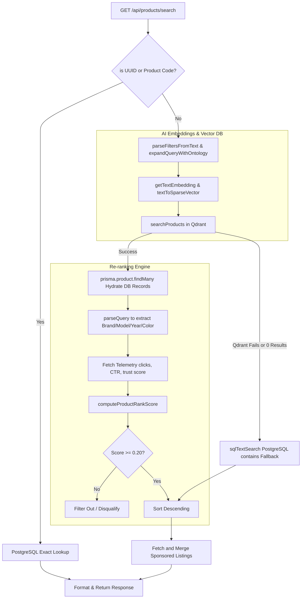

I will fetch from the remote repository and check if there are any changes between the local branch and origin.

Ran command: `git fetch origin && git log HEAD..origin/main --oneline`

I will check if there are any unpushed commits on the local branch.

Ran command: `git log origin/main..HEAD --oneline`

I will list the directory `src/app/api/products/search/` to find the search route handlers and helper files.

Listed directory search

I will view the contents of the marketplace search API handler `src/app/api/products/search/route.ts` to examine the search pipeline.

Viewed route.ts:1-634

I will view `prisma/schema.prisma` to understand the database tables and columns available for exact search filters (like makes, models, years, and categories).

Viewed schema.prisma:1-800

I will search for the definition of `VehicleDetails` in the schema file to see what structured vehicle attributes (like make and model) are stored in the database.

Searched for "model VehicleDetails"

I will look up the line numbers for `model VehicleDetails` to inspect it.

Searched for "model VehicleDetails"

I will view the `VehicleDetails` model fields starting from line 1297.

Viewed schema.prisma:1297-1330

I will view `src/lib/search/ranking.ts` to see how search re-ranking and locks currently behave.

Viewed ranking.ts:1-590

I have inspected the search pipeline and identified the precise flow, where the exact structured SQL search should occur, and how we can stop AI ranking.

---

### 1. Current Search Pipeline Flow
The diagram below traces the current search flow in `src/app/api/products/search/route.ts` from query input to final response:



---

### 2. Proposed Integration for Exact Structured Search
To prevent unrelated models (like G-Class, Audi, Porsche, Jeep) from bleeding into exact queries via vector similarity, we can inject a **PostgreSQL structured search bypass** right before embedding generation.

#### Where it fits:
Between **Step 3 (Query Parsing)** and **Step 4 (Vector Search)**:
Instead of immediately calling the embedding model and Qdrant, we use the lightweight parser `parseQuery` to see if a specific `brand` or `model` is targeted.

#### Flow representation:
```diff
  const { skip: offset, take } = getPaginationParams({ page, limit, order: 'desc' });
  const regionId = regionIdStr ? parseInt(regionIdStr as string, 10) : undefined;
  const smart = parseFiltersFromText('', searchQuery as string);
+
+ // 1. Run parser to see if structured query exists
+ const parsedQuery = parseQuery(searchQuery as string);
+ const targetBrand = (brand as string) || parsedQuery.brand;
+ const targetModel = (model as string) || parsedQuery.model;
+
+ if (targetBrand || targetModel) {
+   // 2. Perform exact make/model DB query
+   const exactMatches = await prisma.product.findMany({
+     where: {
+       status: 'active',
+       deletedAt: null,
+       countryCode,
+       ...(inferredCategorySlug ? { category: { slug: inferredCategorySlug } } : {}),
+       ...(minPriceNum ? { price: { gte: minPriceNum } } : {}),
+       ...(maxPriceNum ? { price: { lte: maxPriceNum } } : {}),
+       ...(regionId ? { regionId } : {}),
+       vehicleDetails: {
+         ...(targetBrand ? { make: { equals: targetBrand, mode: 'insensitive' } } : {}),
+         ...(targetModel ? { model: { equals: targetModel, mode: 'insensitive' } } : {}),
+       }
+     },
+     include: { ... }
+   });
+
+   // 3. Fast bypass: If exact matches exist, return them immediately and skip Qdrant/AI entirely!
+   if (exactMatches.length > 0) {
+     return formatPaginatedResponse(exactMatches, exactMatches.length, { page, limit });
+   }
+ }

  // 4. Fallback to vector search if no exact DB matches found
  let queryEmbedding: number[] | null = null;
  ...
```

* **Advantage**: If a user searches for `"ابي مرسيدس اس 400"`, the parser detects `make="Mercedes"` and `model="S400"`. The database queries PostgreSQL directly on indexed columns, returning exactly those records. This runs in milliseconds, bypasses Qdrant/AI re-ranking completely, and eliminates unrelated vehicle bleed.
* **Fallback**: If the exact query yields 0 database rows, it falls back to the hybrid Qdrant search (allowing similar S-Class family matches like S350 to display).

---

### 3. Stopping AI Ranking (or Qdrant re-ranking score logic)
If we want to stop AI ranking entirely, we have two options:
1. **Disable `computeProductRankScore` re-ranking**: Instead of applying complex pricing, freshness, and telemetry boosts, we can simply sort products based on Qdrant's raw similarity score (optionally filtering out mismatching brands/models).
2. **Standardize all scores to raw similarity**: We skip the `computeProductRankScore` loop entirely and map the hydrated products back to the order returned by Qdrant.